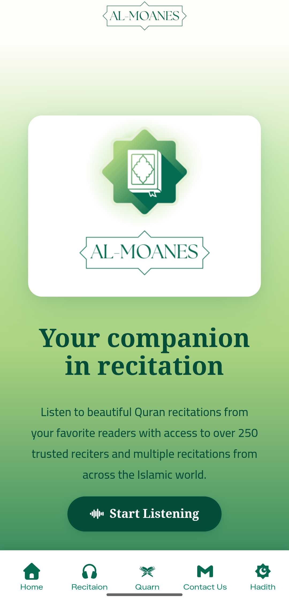
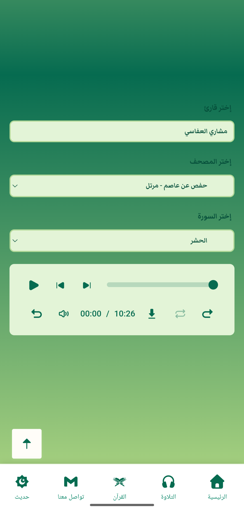

<p align="center">
  
</p>

<p align="center">
    <a href="https://github.com/RezoualiRaouf/Al-Moanes/stargazers">
    
  
  <a href="./LICENSE">
    
  </a>
  <a href="https://techforpalestine.org/">
    
  </a>
</p>

---

## Features

- **250+ Reciters** — Browse and search a wide catalog of trusted Quran reciters
- **Multiple Rewayat** — Select from different narration styles (Rewaya) per reciter
- **Full Audio Player** — Play/Pause, skip ±10s, progress bar, mute, loop, and next/previous surah controls
- **Download Surahs** — Download any recitation directly to your device
- **Multilingual** — Full Arabic and English UI support with RTL layout for Arabic
- **Responsive Design** — Optimized for both desktop and mobile with a dedicated bottom navigation bar

---

## Preview

### Desktop

<table>
    <td></td>
    <td></td>
    <td></td>
  </tr>
</table>

### Mobile

<p align="center">
  
  &nbsp;&nbsp;&nbsp;&nbsp;
  
</p>

---

## Project Structure

```
Al-Moanes/
├── assets/             # Icons, logos, SVGs, and favicons
├── components/         # SCSS component files (nav, hero, player, footer…)
├── scripts/
│   ├── fetchRecitation.js   # Fetches reciters, narrations, and surahs from API
│   ├── audioPlayer.js       # Audio player logic and controls
│   ├── translation.js       # i18n translation strings
│   ├── languageSwitcher.js  # AR/EN language toggle
│   ├── sideBar.js           # Desktop sidebar behavior
│   ├── mobileNav.js         # Mobile bottom navigation
│   ├── contactForm.js       # EmailJS contact form handler
│   └── newsLetter.js        # Newsletter subscription handler
├── index.html          # Main entry point
├── style.scss          # Root stylesheet (imports all components)
└── LICENSE
```

---

## API

This project uses the **[MP3 Quran API](https://mp3quran.net/)** to fetch reciter data, narration styles, and audio files.

---

## Contributing

Contributions are welcome and appreciated!

1. Fork the repository
2. Create a new branch: `git checkout -b feature/your-feature`
3. Commit your changes: `git commit -m 'Add some feature'`
4. Push to the branch: `git push origin feature/your-feature`
5. Open a [Pull Request](https://github.com/RezoualiRaouf/Al-Moanes/pulls)

---

## License

This project is licensed under the [MIT License](./LICENSE).

---


